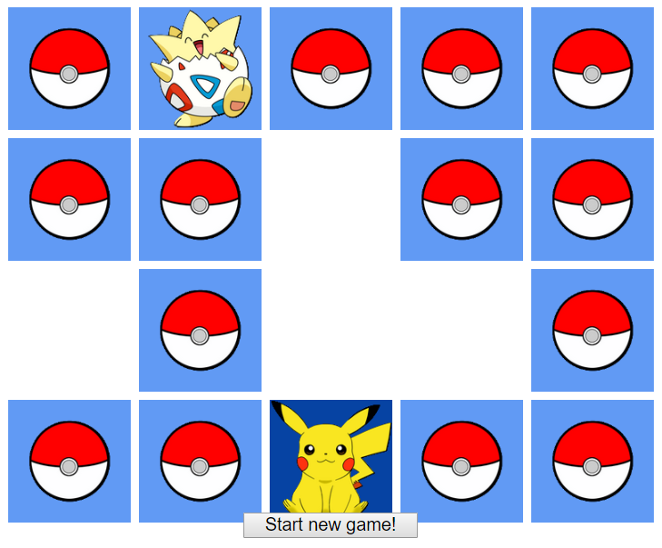

# Memory_Game

> Memory game in pure JavaScript

## How to play?
* Click on tiles and guess all the pairs!

You can play here: https://michalpawelec.github.io/Memory_Game/

## Used technologies and tools:
* CSS3
* HTML5
* JavaScript
